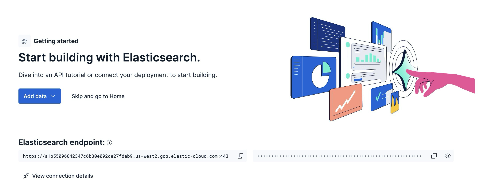

Just download the [index dump](https://storage.googleapis.com/faces-dataset/vectorfaces-index-dump.tar.gz), unzip it and run the index.py script like so:



With your Elasticsearch endpoint and your API key, we are ready to run setup, so the indices are created:
```
pip install elasticsearch

python setup.py --es_url https://your-elastic-cloud-deployment.us-west2.gcp.elastic-cloud.com:443 --es_apikey your-api-key

```


Then index the data on each of the four indices:

```
python index.py faces-int8_hnsw-10.15 --es_url https://your-elastic-cloud-deployment.us-west2.gcp.elastic-cloud.com:443 --es_apikey your-api-key

python index.py faces-int4_hnsw-10.15 --es_url https://your-elastic-cloud-deployment.us-west2.gcp.elastic-cloud.com:443 --es_apikey your-api-key

python index.py faces-bbq_hnsw-10.15 --es_url https://your-elastic-cloud-deployment.us-west2.gcp.elastic-cloud.com:443 --es_apikey your-api-key

python index.py faces-disk_bbq-10.15 --es_url https://your-elastic-cloud-deployment.us-west2.gcp.elastic-cloud.com:443 --es_apikey your-api-key

```

Alternatively, you can also create all the indices then just index the first one, say `faces-bbq_hnsw-10.15` - after you verify it contains all the documents you can just reindex onto the other indices like below, open up **Kibana>Dev Tools** and run:

```
POST _reindex?requests_per_second=-1
{
  "source": {
    "index": "faces-bbq_hnsw-10.15"
  },
  "dest": {
    "index": "faces-int8_hnsw-10.15"
  }
}

POST _reindex?requests_per_second=-1
{
  "source": {
    "index": "faces-bbq_hnsw-10.15"
  },
  "dest": {
    "index": "faces-disk_bbq-10.15"
  }
}

POST _reindex?requests_per_second=-1
{
  "source": {
    "index": "faces-bbq_hnsw-10.15"
  },
  "dest": {
    "index": "faces-int4_hnsw-10.15"
  }
}
```